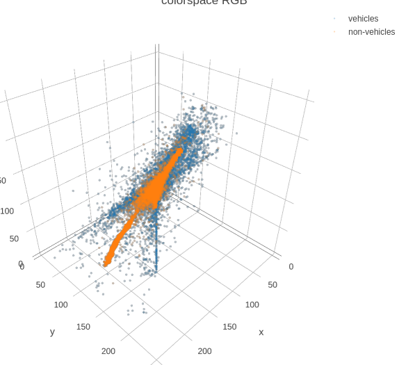
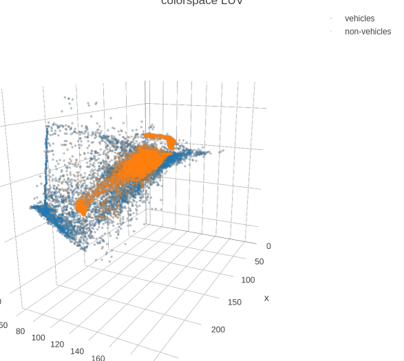
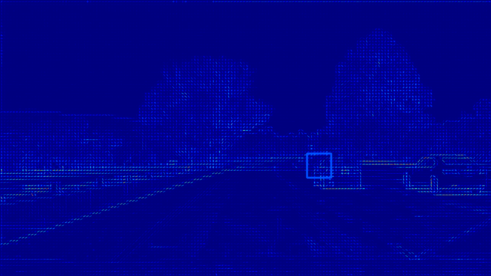
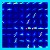
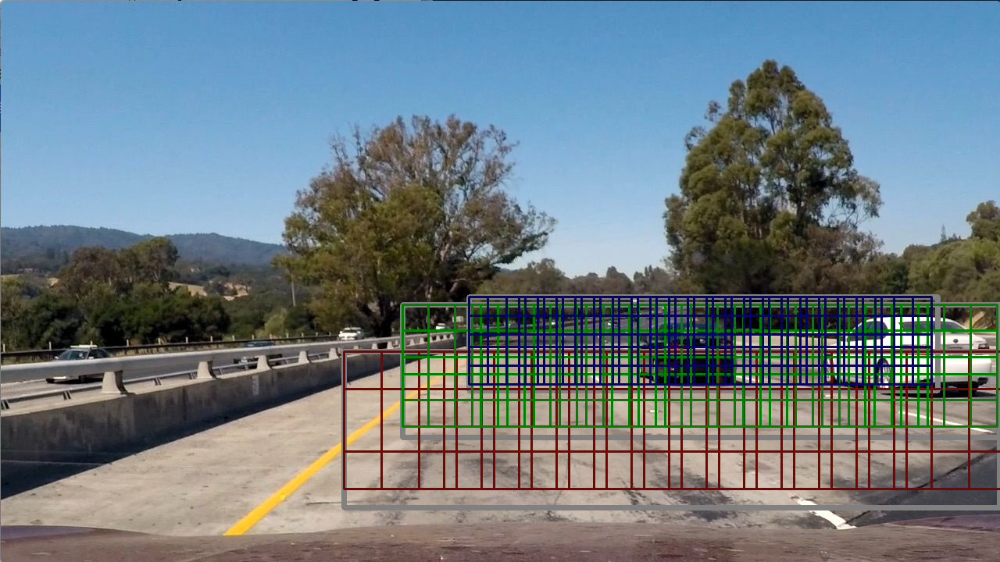
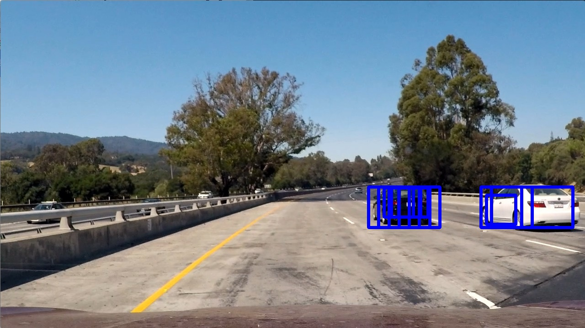
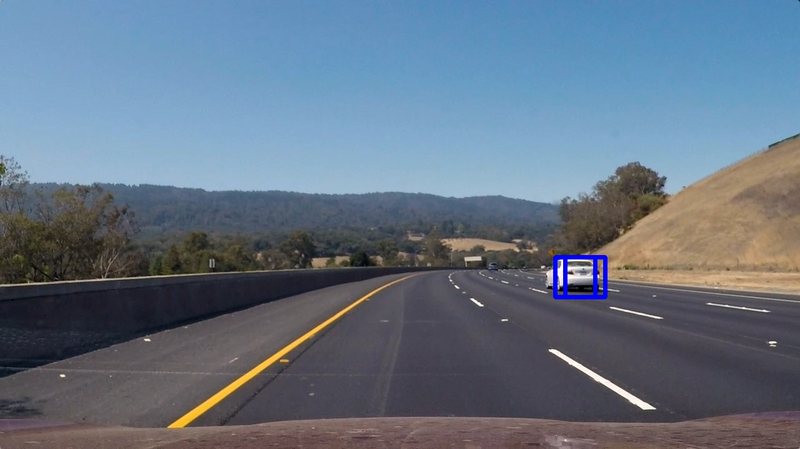
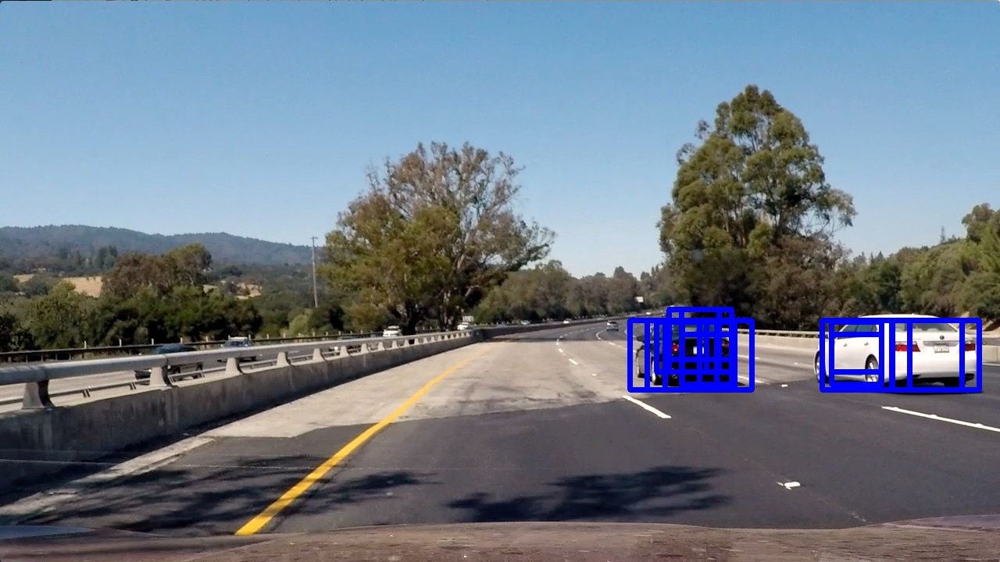
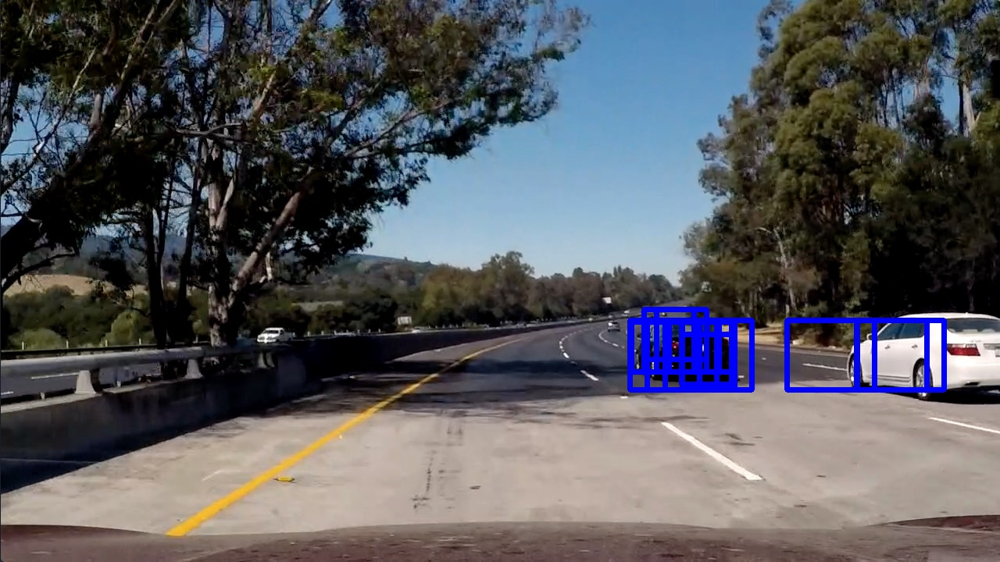
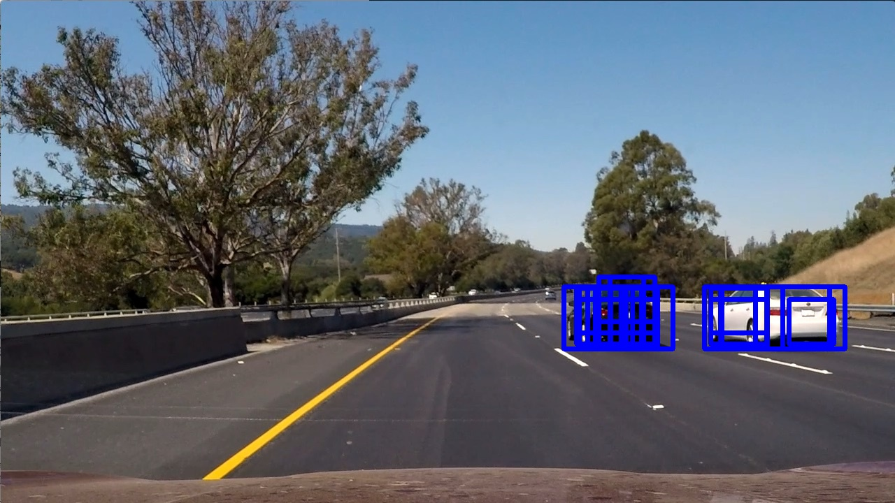

***Vehicle Detection Project***
Brian Erickson

This project implements the *Vehicle Detection* project of the Udacity Self Driving Car NanoDegree.

The  code and investigations for the project located in the Jupyter notebook [Vehicle-Detection.ipynb](Vehicle-Detection.ipynb)

The goal is to track cars on the road and draw bounding boxes to identify the car locations.

Training data includes many 64x64 images that are labeled as cars or not cars.  I these are found at https://s3.amazonaws.com/udacity-sdc/Vehicle_Tracking/vehicles.zip and https://s3.amazonaws.com/udacity-sdc/Vehicle_Tracking/non-vehicles.zip.  THe files included 8792 car images and 8968 non-car images.

The pipeline used includes the following
- Change the image colorspace to LUV for enhanced detection
- Create spatial features for pixel
- Create histogram features for colors
- Create HOG features
- Train an SVM classifier using spatial, color, and HOG features
- Apply SVM classifier to multi-scale sliding windows
- Generate a heat-map of matching patches
- Accumulate heat-map between frames
- Label thresholded areas of heat map
- Calculated and draw bounding boxes on labeled areas

The final output for the project is the video [heatmap_class_project_video.mp4](output_videos/heatmap_class_project_video.mp4)

Output images and videos exemplifying different processing steps are located in the "output_videos" and "output_images" folders.

The rubric for the project is located [here](https://review.udacity.com/#!/rubrics/513/view)

### Detection Approach Overview

To classify images patches as either car or non-car, I used a single linear support vector machine (SVM).  The SVM was trained using the following kinds of features:

- HOG based image features
- Color based features (pixels)
- Histograms of intensities from the image color channels

The SVM is run on patches using a sliding window at various scales where vehicles can be expected.

A heatmap is generated that accumulates detection counts from the various patches, and across frames.

The HOG features are calculated once per scale factor which improves performance over calculating separate HOG features per patch.

A thresholding technique is used to smooth out detections.  A labeling function is then applied and bounding boxes are generated from the labeled image.  Finally these bounding boxes are drawn as overlays of the source video and saved to a destination video.

### HOG Features and Parameter Selection
There are several parameters that effect the performance of the performance of the SVM.  My code that would try different parameter settings, score the SVM at prediction against the training data.  In general, I would pick the best scoring parameter, but I also considered the affect on feature vector lengths and would favor a similar scoring parameter value if it would greatly reduce the feature vector size.

These tests are shown in the "Parameter Optimizations" section of the [notebook](Vehicle-Detection.ipynb)

From run to run, randomness would cause different outcomes, I took what looked like generally the best outcomes across runs.

#### Colorspace
I wrote a color conversion function "rgb_to_colorspace" to aid in colorspace conversion.  I used 3d visualizations to see that color separation of cars / non cars was clearly better in color spaces that take perceived color into account such as HSV and LUV.  

##### RGB Plot

##### LUV Plot

After doing a parameter search for the best performing, I decided to use the LUV colorspace for HOG features as well as color histogram and spatial features.

#### HOG Channels
As much as I would like to reduce the processing time, it was clear that using all three images channels for the HOG features was superior, so my classifier uses all three of the YUV image channels.

#### Cells Per Block
The HOG cells_per_block parameter defines a region around each block where features are normalized.  I found little benefit in increasing from 1 cell per block to 2 or 3 cells per block.  Since this parameter causes a huge explosion of HOG hog feature count related cells_per_block^2, I decided to keep cells_per_block at 1.

#### Pixels per cell
Since the training images 64x64, I wasn't surprised that the 8 pixels per cell was the best value.  This gives a good trade-off between pixel count and cell count.

#### Orientations
I selected 12 orientations for the HOG. This gives a good number of directions without too much worry on over-fitting.

#### Classifier Training
Once I selected the parameter values. I trained the SVM with the full set of data.  I used the StandardScaler class from sklearn.preprocessing to ensure that my features were roughly the same magnitudes and centered around zero (zero mean and unit variance).  I was careful to apply the same scaler during processing and evaluation.

### HOG Visualizations
Here are examples of an HOG features visulaized for both an entire image 

and the associated image patch

### Sliding Window Search

A sliding window search was used to find car / non car patches. The function "car_detector_find_cars / CarDetector.find_cars()" finds cars using a specific scale and bounding rectangle.  The function "car_detector_find_cars_multiscale / CarDetector.find_cars_multiscale" supplies several scales and bounding rectangles.  The bounding boxes were necessary to keep the processing time down.  Before optimizations, I was running several seconds to process each image. After tightly constraining my search, I was able to greatly speed up processing to about 3 to 4 frames per second (fps).

Below is a visualization of the sliding window search areas I chose:

Each small box represents a cell, the sliding window algorithm uses cells_per_step = 2 to further reduce the number of patches to investigate.

Here are some example detections using the mutli-scale search technique where all matching patches are drawn:

### Improving False Positives / False Negatives

After clipping the region to avoid false positives from the trees, etc. by concentrating on highway lanes, I still had false positives and negatives in the video.

I used a heat-map approach to even out the detection.  For each patch, I add "heat" to a heat map image.  I keep the same image between frames, and then let the heat map "cool off" a little per frame by subtracting.  See the "HeatMap" class in the notebook for details.

### Bounding Box Determination
After applying  a heat-map threshold, I  use the scipy.ndimage.measurements.label function to label regions.  Pixels in each region are given a unique label.  I used the pixel extents of these to generate the bounding boxes and draw the bounding boxes to the images in the video stream.

### Final Video
The final video is [output_videos/heatmap_class_project_video.mp4](output_videos/heatmap_class_project_video.mp4)

### Discussion

By itself, the SVM classifier with HOG features wasn't able to reliably tell cars from non-cars.  I had very noisy detections, especially around trees.  Luckily the input video was easy to manually partition into search areas.  Even with this, a heat map had to be used to improve the detection performance.  

Before I cropped out the trees, some of the trees would have more patches with detection hits than the cars had.

I wouldn't feel safe if this were the only method of finding cars on thee road.

One of the challenges I had was getting the performance fast enough.  Luckily, optimizing the HOG feature detection and limiting the search areas made it so I could go through the project video in under 10 minutes.  Still, that Is way slower than I would want for real time.

When going from patch based HOG to full image based HOG for performance, I did notice that the results were different.  I debugged it for several hours. I think this may be a problem in how the HOG features are generated.  The first step in creating HOG fatures is to calculate image gradients.  At the edges, gradients from stand alone patches will be different than patches take from a larger image where the gradients include neighboring pixels.  Different gradients give you different features.

I think the test data should probably contain full images with labels applied to bounding boxes.  This would more closely relate to the single HOG approach taken in this project.  Of course, that's a lot of labeling work.

I think a way to improve the detection would be to focus on road / non road detection.  Once the lane detection logic finds lanes, it can expect road between the lines.  Discriminating between the road and cars would be easier than discriminating between "anything else in the world" and cars.

Also, I think that optical flow could be useful.  If parts of the image aren't moving along with the road, then they are more likely to be cars.

Other opportunities would be to use other types of classifiers like the Haar classifier or other modeling techniques such as decision trees or neural networks.

